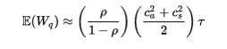
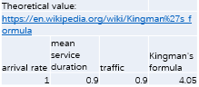

# randomness-simulation-in-single-server-queue

A single-server queue: where people arrive for service randomly, then take time in service. If someone arrives while the server is busy, or while other people are in line, they wait in line too.

Simulate a single-server queue with random times between arrivals and purely deterministic service.

my wait time = the wait time of the person in front of me, plus his/her service time, minus the time between when he/she arrived and when I arrived. Except if that answer is negative, then just give 0 (I arrived after the person had departed)

In queueing theory, a discipline within the mathematical theory of probability, Kingman's formula is an approximation for the mean waiting time in a G/G/1 queue. 

In this problem, E(Wq) = 4.05

